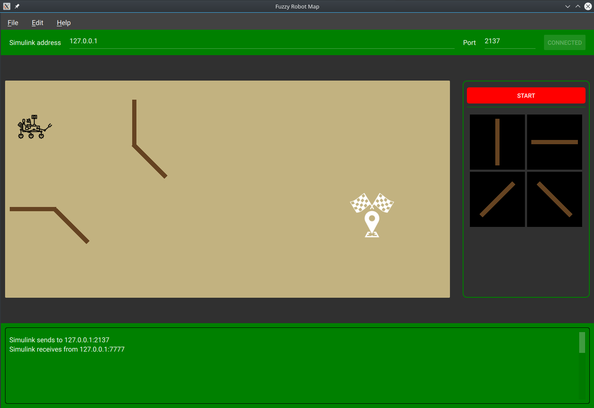
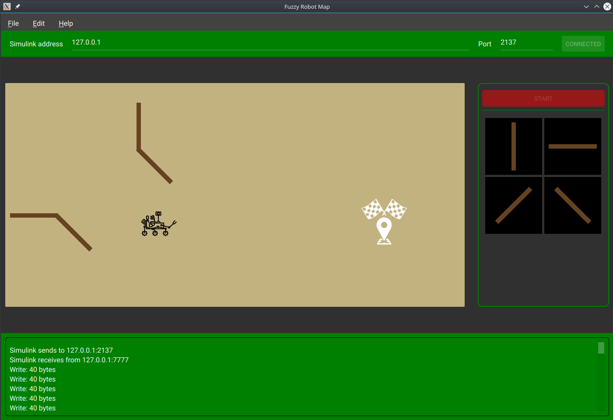

# mobile-fuzzy-robot
C++/QML simulation of robot movement, which is controlled by fuzzy controller (Simulink).

## Description
This is a project of simulation a robot movement. The robot is controlled by a fuzzy controller (TSK) and it should go to the meta point. These two applications are bounded by the UDP connection. 
This project was executed in cooperation with [tornado561](https://github.com/tornado561) (aka Krzysztof Pikul).

## Requirements

### Controller
The controller was created in Simulink (see: <i>controller</i> directory). It requires Simulink Real-Time framework which is currently only supported on Windows and macOS. the simulation is in real-time and hasn't the maximum time limit.
The Fuzzy-Logic Controller toolbox should be also installed.

### Simulator
The simulation application was written in C++/QML based on Qt framework. So you should install the Qt in at least 5.12 version. The view is created in QML, but the logic, communication and obstacle detection are written in C++.

## Example usage

Open the <i>robot_controller.slx</i> from <i>controller</i> directory in Simulink. Be aware that the <i>robot.fis</i> should be in the same directory (it cotains the fuzzy rules)! Then run the qt application. You should set the IP address (localhost if empty) and UDP port (by default, the port is <b>2137</b>). After clicked on connect, you should see the confirmation in logs (notice that the 7777 is a second application port and cannot be changed):

Now insert the obstacles on the map area (or load from example (<i>maps</i> directory) : File > Open...). You can move the robot and meta, too. After the start button had clicked, the robot started its move:

When the meta will be achieved, the Simulink simulation will be stopped.
